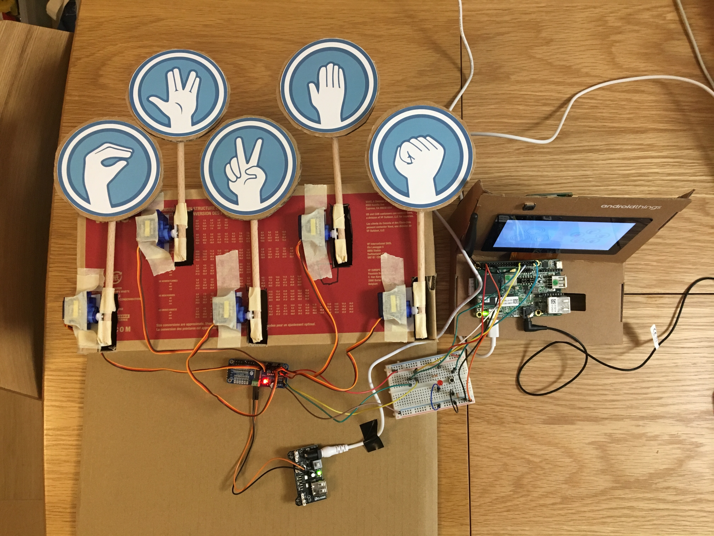

Playing Rock-Paper-Scissors-Lizard-Spock with your Android Things
=================================================================

This project is a hand game robot that can play Rock-Paper-Scissors-Lizard-Spock with you. The robot is built with:

- An [Android Things NXP i.MX7D starter Kit](https://androidthings.withgoogle.com/#!/kits/starter-kit)
- A [16 channel PWM/Servo driver](https://learn.adafruit.com/adafruit-16-channel-pwm-slash-servo-shield/overview)
- 5 [SG-90 servo motors](http://www.ee.ic.ac.uk/pcheung/teaching/DE1_EE/stores/sg90_datasheet.pdf)
- A LED & a push button
- Shoebox & duct tape :)

Glue gun is used to stick certain parts together.

The robot is controlled by an Android Things application with an embedded TensorFlow lite model which recognizes the opponent player's hand gesture. The game play sound is mainly built with [Android TextToSpeech API](https://developer.android.com/reference/android/speech/tts/TextToSpeech). 

The machine learning model was initially trained with photo that:

- I crawled from internet
- provided by friends & co-workers via the data collector tool I developped (in this repo)
- taken by myself 

The final results looks like:

Here are 2 videos that show the robot in action:

- [It's a tie](https://www.youtube.com/watch?v=UI5oJqhSCxU)
- [Michaël won!](https://www.youtube.com/watch?v=bb5buoGCaMA)

# Repo structure

This repository contains:

- A data collector tool
- Android Things application
- Trained TensorFlow lite model used in this project
- TODO: circuit map

# Future plans

- Machine learning training pipeline
- Google Translate for Sign langue

# Related talk

The project was initially presented during [Xebicon 2018](https://xebicon.fr/) at Code As A Passion section, you can find the slides [here](https://speakerdeck.com/jinqian/play-rock-paper-scissors-spock-lizard-with-your-android-things).